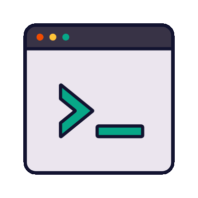

<!--
**mrvin100/mrvin100** is a ✨ _special_ ✨ repository because its `README.md` (this file) appears on your GitHub profile.

Here are some ideas to get you started:

- 🔭 I’m currently working on ...
- 🌱 I’m currently learning ...
- 👯 I’m looking to collaborate on ...
- 🤔 I’m looking for help with ...
- 💬 Ask me about ...
- 📫 How to reach me: ...
- 😄 Pronouns: ...
- ⚡ Fun fact: ...
-->

## VINCENT YOUMSSI

<!-- home section starts -->
<section display="flex" justify-content="space-between" gap="10px">

<!--  
-->

Hi, call me  <strong>Vincent</strong> 
I’m a front end developer base in Africa/Cameroon 
I’m currently learning Nextjs (React Framework)

</section>

### Front end Developper.

 <h3 text-align="center" font-size="0.938rem"  color="#fd4567">  VINCENT/JEANDOE </h3>

### How to reach me
+ [Portfolio](https://vincentyoumssiportfolio.great-site.net)
+ [telegram](https://t.me/mrvincent)
+ [mail](vincentyoumssi@gmail.com)
+ [Team48](https://team48.great-site.net)

<!---
Vincent/vincent is a ✨ special ✨ repository because its `README.md` (this file) appears on your GitHub profile.
You can click the Preview link to take a look at your changes.
--->

